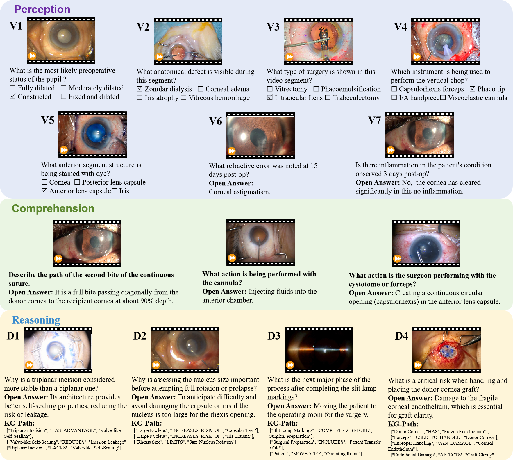

# 🌲 EyePCR Dataset

**EyePCR**：A Comprehensive Benchmark for Fine-Grained Perception, Knowledge Comprehension and Clinical Reasoning in Ophthalmic Surgery

[🌐 Dataset Page](https://huggingface.co/datasets/EvergreenTree/EyePCR) • 
[📄 Paper]() • 
[💻 GitHub](https://github.com/CVI-yangwn/EyePCR)

      

      

